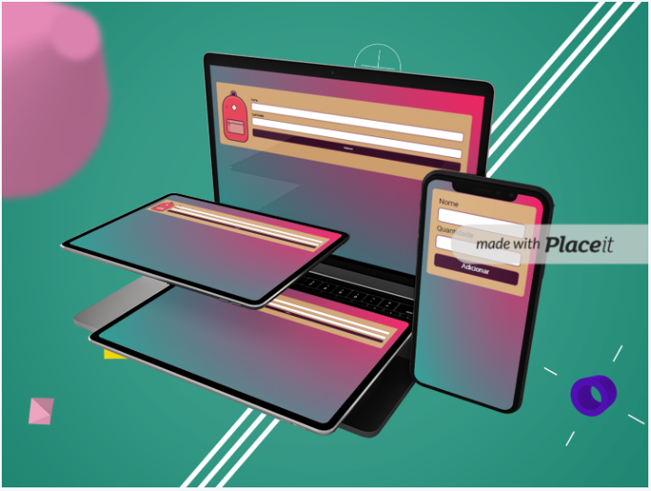
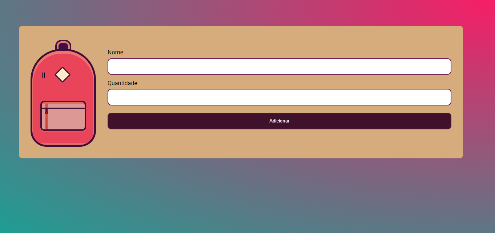
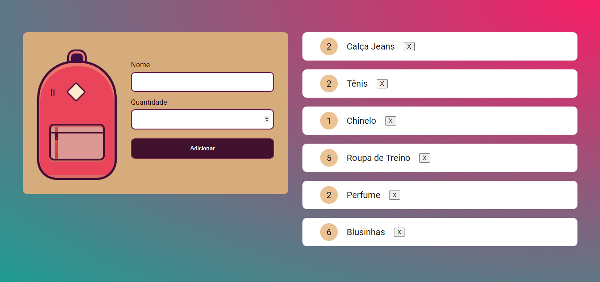

# Mochila de Viagem!

### Desenvolvendo projeto JavaScript para interação com os elementos.

##### A partir de um projeto Html e CSS criado pela Tricia Katz https://codepen.io/triciaakatz. Desenvolvi e personalizei esse projeto com o intuito de me familiarizar e solidificar os conhecimentos de JavaScript. Com ele aprendi a trabalhar e armazenar os dados no navegador, tratar os dados com JSON.stringfy e JSON.parse e interagir com o localStorage. Sigo buscando novos desafios e aprimorando minhas habilidades a cada novo projeto.

##### Seguindo com o projeto fui desafiada por outros dois colegas desenvolvedores a criar o layout responsivo adaptativo e incluir uma estrutura de controle, que não permita adicionar itens vazios ou com valores negativos e zerados.

## Segue abaixo layout da aplicação:

---

## Projeto criado por:

---

## Contato

## Linguagens

